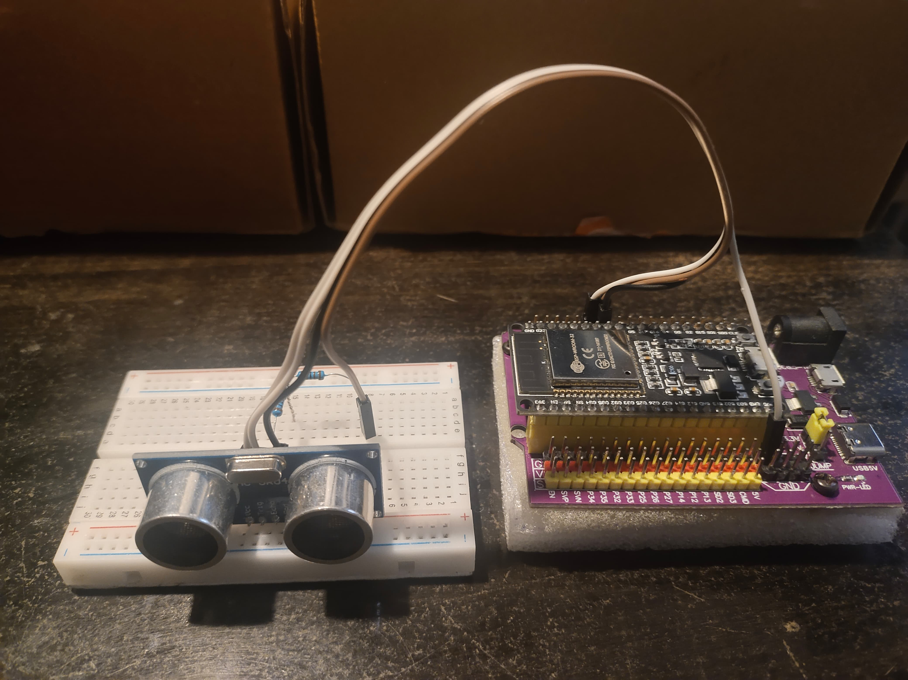

# Distance Measurement and Obstacle Avoidance
---
  

## Overview
This project is designed to measure distances using an **HC-SR04 Ultrasonic Sensor** and display the results either on an **OLED screen** or through the **Serial Monitor**. It can be used for obstacle detection in robotics and IoT applications.

## Components Used
- **ESP32** (Microcontroller)
- **HC-SR04 Ultrasonic Sensor**
- **OLED Display (128x64)** (For Display Version)
- **Jumper Wires**
- **Voltage Divider for Echo Pin** (1Ω +2Ω ->pin)

## Features
- Measures **distance in centimeters**.
- Two versions available:
  - **OLED Display Version**: Displays measured distance on an **OLED screen**.
  - **Serial Monitor Version**: Outputs distance values to the **Serial Monitor**.
- Uses a **voltage divider** to protect the ESP32 from the 5V echo signal of the HC-SR04 sensor.

## Pin Configuration
| Component    | Pin |
|-------------|-----|
| **Trig Pin** (HC-SR04)  | 19  |
| **Echo Pin** (HC-SR04)  | 18  |
| **OLED SDA**            | 21  |
| **OLED SCL**            | 22  |

## Working Principle
- The **ESP32** sends a **trigger pulse** to the **HC-SR04 sensor**.
- The **HC-SR04 sensor** responds with an **echo pulse**, whose duration corresponds to the measured distance.
- The ESP32 calculates the **distance** based on the time taken for the echo pulse.
- The measured distance is then **displayed on the OLED screen** or printed to the **Serial Monitor**.

## Usage
- **OLED Version**: The distance is updated every **1.5 seconds**.
- **Serial Monitor Version**: The distance values can be monitored on a PC via **Serial Communication**.

## Future Enhancements
- Adding a **buzzer alert** for obstacles within a specific range.
- Implementing **wireless communication** (Wi-Fi/Bluetooth) for remote monitoring.
- Integrating with a **robotic system** for real-time obstacle avoidance.
---
## Author
Aryan Kumar