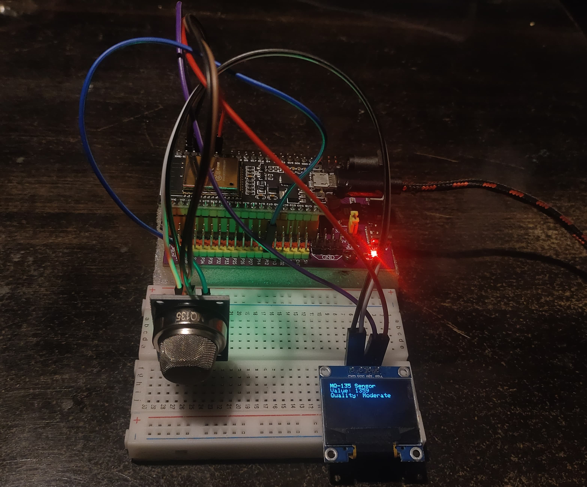

# Air Quality Monitoring System
---
## Description

The Air Quality Monitoring System uses an MQ-135 gas sensor to measure air quality and displays the results on an OLED screen. It categorizes air quality into four levels: Good, Moderate, Poor, and Hazardous, based on the analog readings from the sensor.

## Components Used

- **ESP32**: Microcontroller for reading sensor data and controlling the OLED display.
- **MQ-135**: Gas sensor to detect air quality.
- **OLED Display (128x64)**: Used to display the air quality information. ( Optional )
- **Jumper Wires**: For connections.
- **Breadboard** (optional)

## Pin Connections

| Component     | ESP32 Pin |
| ------------- | --------- |
| MQ-135 Sensor | P12       |
| OLED SDA      | P21       |
| OLED SCL      | P22       |

## Features

1. **Real-Time Monitoring**:

   - Continuously measures air quality and updates the display every 1.5 seconds.

2. **Categorization of Air Quality**:

   - Displays air quality levels: Good, Moderate, Poor, or Hazardous.

3. **Easy Calibration**:

   - Observed values in the environment can be used for fine-tuning thresholds.

## Setup

Ensure all components are connected as described in the pin connections table. Install the required libraries, including `Adafruit_SSD1306` for OLED display control, before uploading the code to the ESP32.

---
##  Review

The OLED display updates every 1.5 seconds to show the current air quality:

- Sensor value : 1359
- Air quality level : Moderate

Additionally, data is logged to the serial monitor for debugging and analysis.
You can also use without display script to get data from the serial monitor.

---
